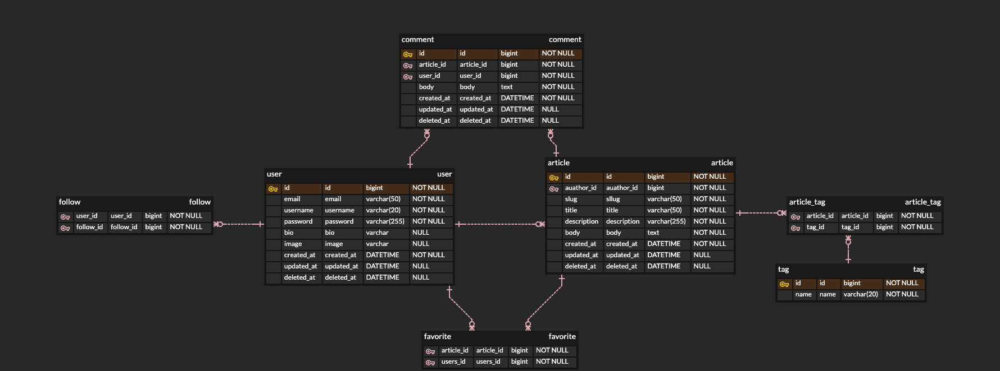

[](https://github.com/real-world-study/realworld/actions/workflows/build.yml)   [](https://codecov.io/gh/real-world-study/realworld)


## Getting started

need Java 11 installed

```
$ ./gradlew build bootRun
```


## 프로젝트 진행 사항

- 언어 : JAVA 11
- 프레임워크 : Spring Boot
- 빌드툴 : Gradle 6.9
- db : h2
- 테이블 구조 : 일요일에 각자 테이블 구조 제출 후 통합
- 커버리지 : 70 (jacoco line coverage)
- 의존성 : jpa / jdbctemplate
- 브랜치 네이밍 : 원본브랜치 : 아이디, 작업 브랜치 : 아이디-이슈번호
- 커밋 단위 : 기능당 최소단위 (TDD 옵션)
- 리퀘 양식 :

```
issue: #이슈번호
## 작업 내용
작업1
작업2
## 생성/변경 로직 (구현한 내용에 대한 설명)
## 개인 코멘트 (구현하면서 느낀 내용 간단하게 가능)
```

- Pull Request 제한 조건 : 3명 approve, build pass
- 코드리뷰 추가 요청 사항 : approve가 되어도 풀리퀘 머지 담당자가 조금 미뤘다가 머지.
- 컨벤션 : google java format build


## API

###  [API document WIKI](https://github.com/real-world-study/realworld/wiki/API-documentation)

## ERD


