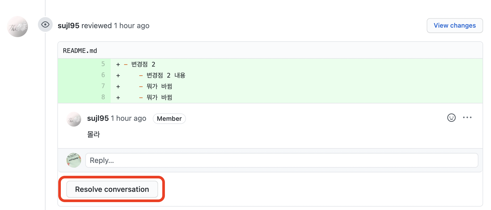
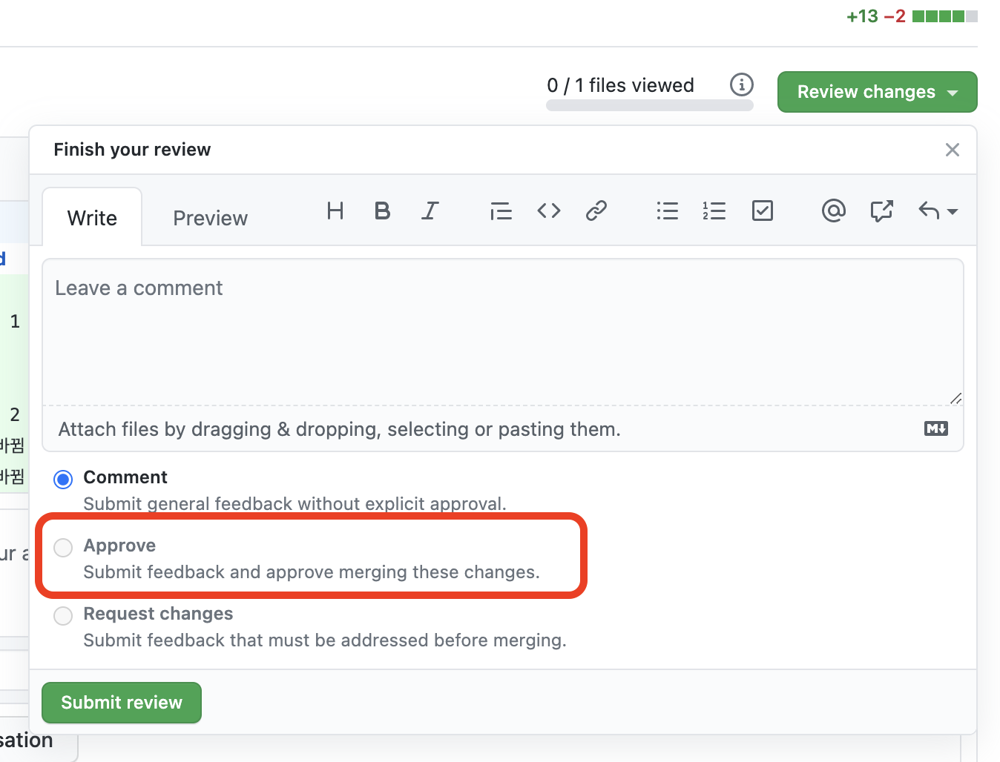

# 온라인 코드리뷰 가이드 라인

현재 진행중인
프로젝트는 [Github Pull Request(PR)](https://docs.github.com/en/github/collaborating-with-pull-requests/proposing-changes-to-your-work-with-pull-requests/about-pull-requests#about-pull-requests)
를 코드 리뷰 툴로써 코드 리뷰 시스템을 통해 진행됩니다.

## 코드 리뷰 가이드

- [환경 세팅](./develop_environment.md)
- [pull request](./pull_request.md)
- [review](./review.md)

## 코드 리뷰 요청 사항

코드 리뷰를 요청하더라도 리뷰어와의 서로 효과적이고 효율적으로 소통하기 위해서 몇가지 간단한 요구사항과 함께 진행하는 것을 추천합니다 :)

- PR과 커밋 최대한 작은 단위로 쪼개기

    - 1개의 커밋에는 1개의 행위만 들어 있는 것이 좋습니다
    - 1개의 PR에는 1개의 작업만 들어 있는 것이 좋습니다

- PR 요청 시 최대한 컨벤션에 맞게 작성합니다

    ```
    ## 작업사항
    
    ## 변경 로직
    
    ## 코멘트
    ```


- 제한된 리뷰어들의 리뷰 수 이상이 되었을 때 머지합니다

- 리뷰어가 빌드,테스트코드 성공여부/코딩컨벤션 확인하게하지 않기

    - 빌드와 테스트코드는 PR전에 항상 확인하고 요청 부탁드립니다

    - 사소한 코딩컨벤션은 최소화 해주세요

    ```
    - 불필요한 import 제거
    - 사용하지 않는 변수 제거
    ...
    ```

- 코드리뷰 내용 반영할때 마다 반영된 커밋 id 남기기

모든 것을 완벽하게 지키기는 어렵지만 서로 원할한 소통이 되는 코드리뷰가 되었으면 좋겠습니다 :smiley:

## Merge 조건

1. #### **코드 리뷰 받은 내역에 대해 전부 `Resolve converstaion` 되어야 합니다.**

   

2. #### 3명 이상의 리뷰어가 `Approve`하여야 합니다.



