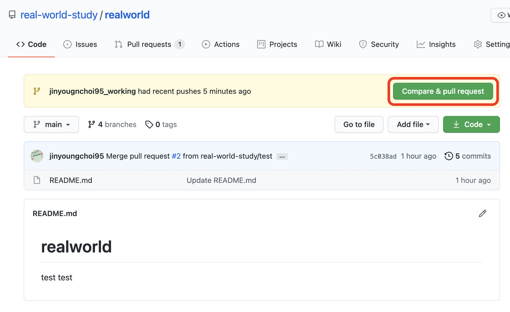
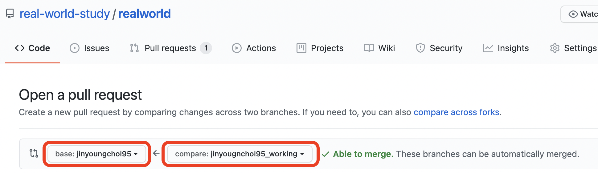
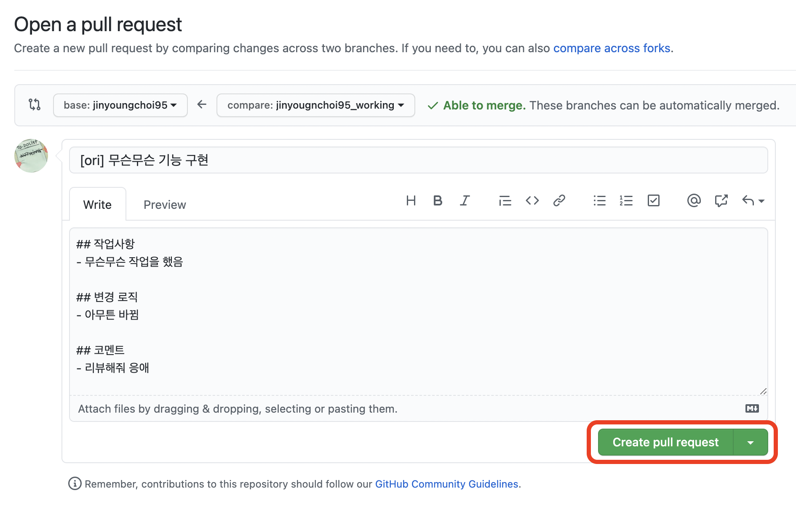
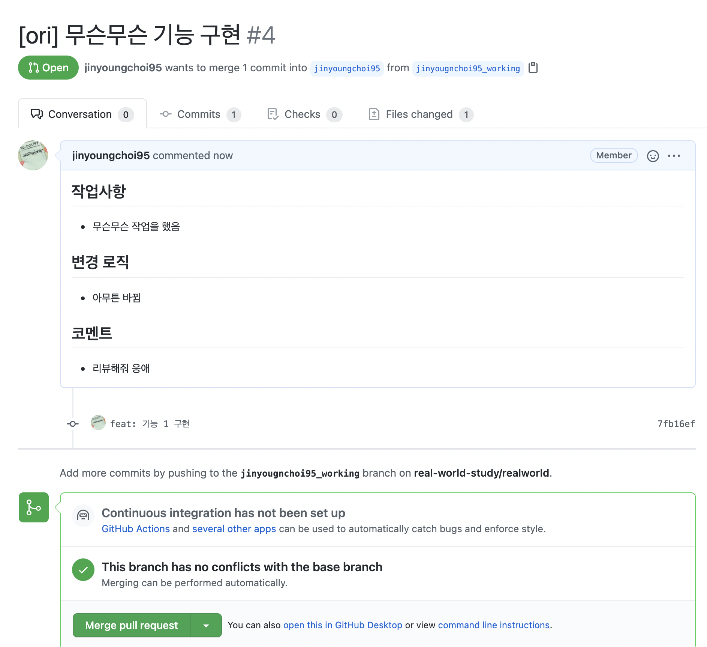
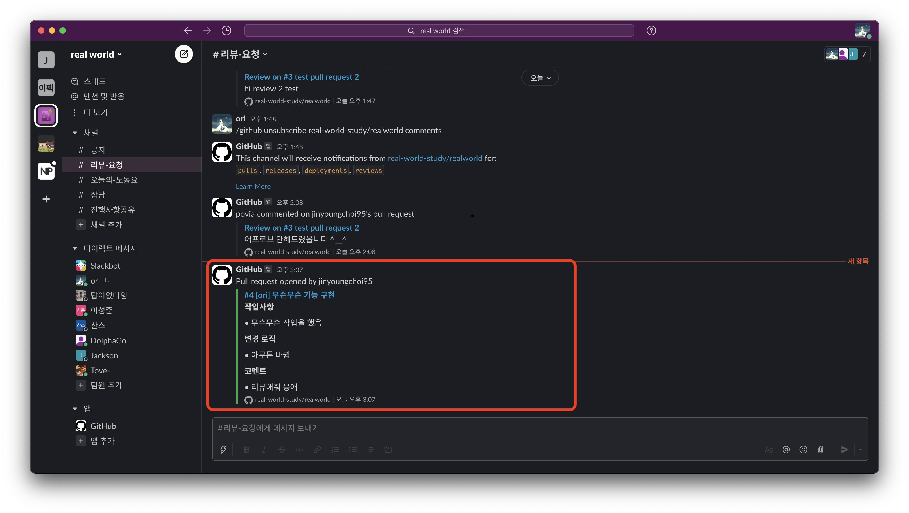

## Pull Request

모든 코드리뷰는 Github Pull Request의 기능을 사용합니다.

1. #### Repository로 갔을 때 변경점이 생긴다면 다음과 같이 표시됩니다.  (단, Pull Request 탭에서 직접 만들수 있습니다.)

2. #### Compare & pull request로 들어가서 pull request 생성창을 엽니다.

- merge option을 `base:{본인_아이디}` <- `compare:{본인_아이디}_working` 로 변경합니다.

3. #### pull request 작업 사항을 다 쓰고 `Create pull request`로 pr을 생성합니다.

4. #### pull request를 확인하고 slack에 pr메시지가 발송됩니다.

