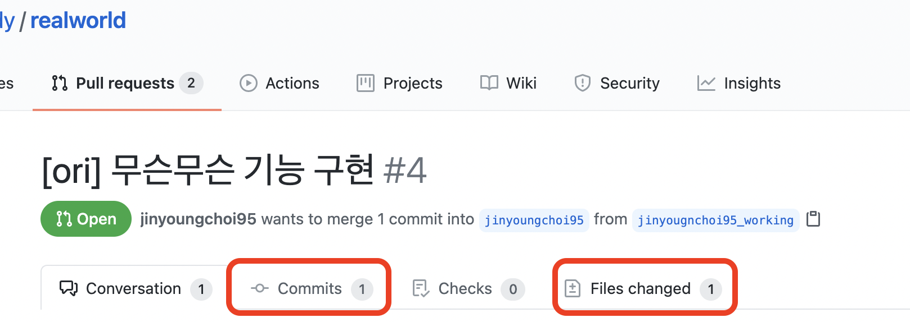
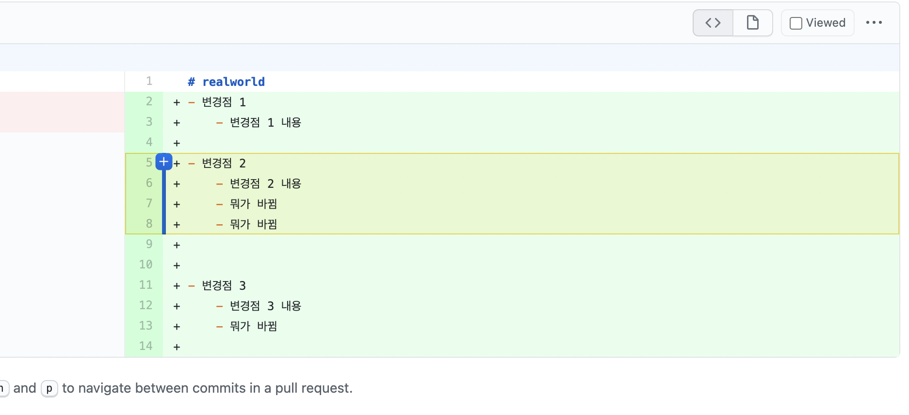
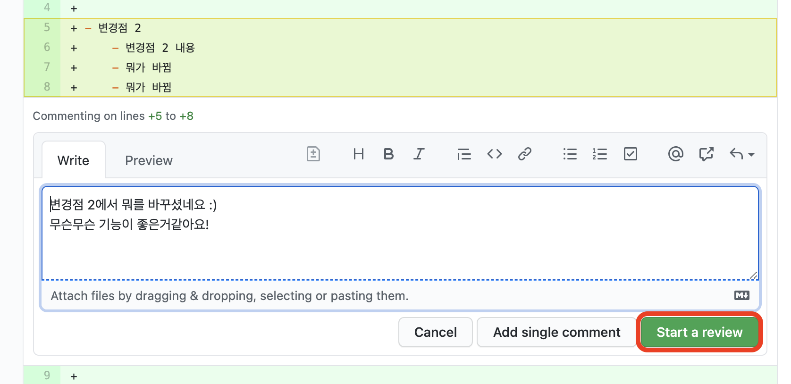
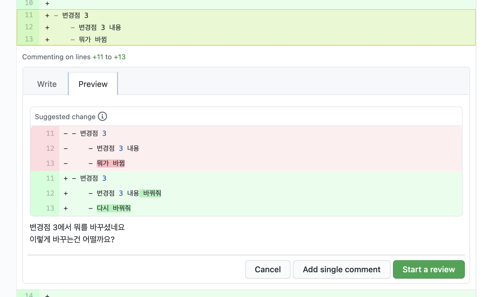
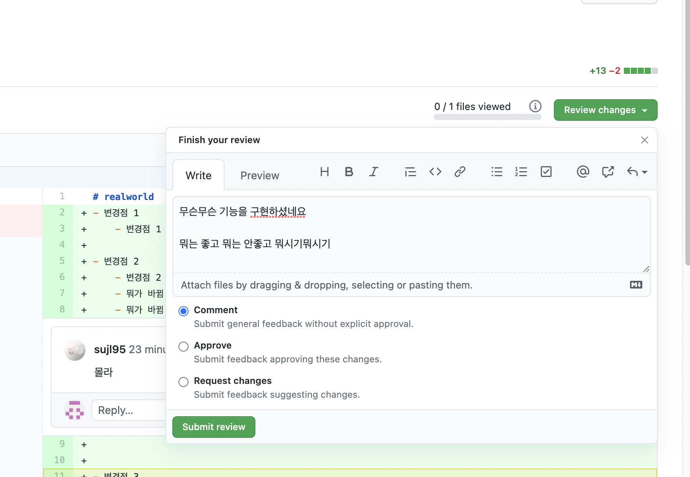

## Review

예시 코드 리뷰는 Github web page 기준으로 작성되었습니다.

### 리뷰어 요청 사항

- 리뷰는 각각의 코드에 대해서 따로 `Add single comment` 를 남기는 것이 아닌, `Start a review`로 남겨주세요
    - comment단위가 아닌 review로 남겨야 slack에 리뷰에 대한 메시지가 발송됩니다.
- 리뷰는 언제나 자유롭게 부탁드립니다!

### 리뷰 방법

1. #### 해당 유저의 `commit` 탭 혹은 `Files changed` 탭에서 코드를 볼 수 있습니다.

2. #### 각각의 코드 변경점을 보고 +버튼을 누르거나(단일 라인) +버튼을 누르고 해당하는 부분까지 드래그 합니다.

3. #### 해당 코드에 대해 comment를 남기고 **"반드시"** `Start a review`를 누릅니다.

4. #### 코드 변경점에 대한 개별 리뷰 이후 `Review changes`를 눌러 전체적인 코드리뷰에 대한 comment를 작성하고 `Submit review` 합니다.

5. #### Comment의 경우 Approve가 안되는 리뷰내용이고 PR이 통과되도록 하고싶다면 Approve로 체크하여 review합니다. 일정 사람 수 이상 Approve할 경우 merge가 승인됩니다.
